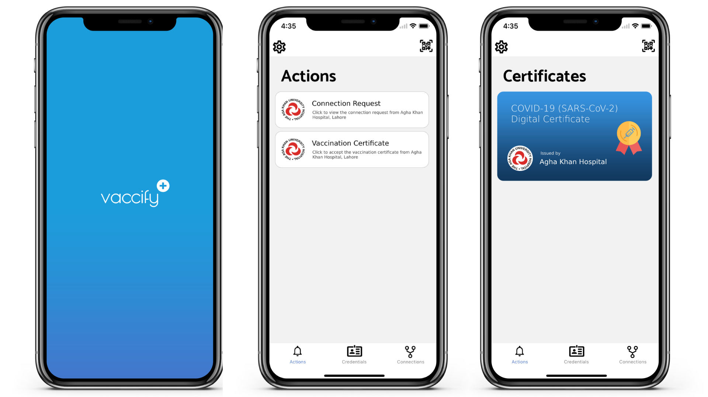

# COV-ID Wallet
A cross-platform digital wallet mobile app that enables people to store and prove COVID-19 digital verifiable credentials. This project works in combination with [Aries Cloud Agency](https://github.com/TrustNetPK/aries-cloudagency-python) and [Aries Cloud Agents](https://github.com/TrustNetPK/cov-id-cloud-agent). You can make it work with any custom [ACA-PY](https://github.com/hyperledger/aries-cloudagent-python) cloud agent. However the app depends on agency multi-tenatn wallet handling.

# Visuals


# How to build and run
```
git clone https://github.com/TrustNetPK/cov-id-wallet.git
cd cov-id-wallet
yarn
cd cov-id-wallet/ios
pod install
```
For iOS:
```
yarn ios
```
For Android:
```
yarn android
```

# License 
<a rel="license" href="http://creativecommons.org/licenses/by-nc-sa/4.0/"></a><br />This work is licensed under a <a rel="license" href="http://creativecommons.org/licenses/by-nc-sa/4.0/">Creative Commons Attribution-NonCommercial-ShareAlike 4.0 International License</a>.
